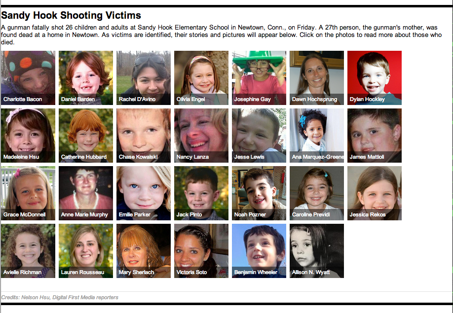

profiler
========

What is this?
-------------

Responsive template for profiling individuals. We used this several times, but the first iteration was built on deadline the day of the mass shootings at Sandy Hook Elementary School in Netwon, Connecticut.

Demo: http://www.nhregister.com/general-news/20121215/newtown-shooting-victims-names-profiles-of-the-27-people-killed

Other examples:
* The Indy Channel's [Indy 500 preview](http://media2.scrippsnationalnews.com/html/indyprofiler/index.html)
* SI.com's coverage of [Ed O'Bannon v. NCAA](http://college-football.si.com/2014/06/05/ed-obannon-ncaa-trial-key-figures/)
* Madison.com's look at the [US National Team](http://host.madison.com/sports/soccer/world-cup/united-states-world-cup-team-profiles/html_ab209018-ec19-11e3-97fb-001a4bcf887a.html) ahead of the World Cup.
* NJ.com's story on [amusement park accidents](http://www.nj.com/news/index.ssf/2014/06/more_accidents_happen_in_water_rides_and_go-karts_data_shows.html)
* Foreign Policy's look at [who should replace Maliki](http://www.foreignpolicy.com/articles/2014/06/24/who_should_replace_maliki_iraq_isis_john_kerry_kurdistan_chalabi_allawi)

Contributors
---------

[Nelson Hsu](https://github.com/hsunelson), Project Thunderdome 
[Frank Bi](https://github.com/frankbi), Newshour 
[Tony Papousek](https://github.com/TonyPapousekFP), Foreign Policy

Assumptions
-----------

* Google docs
* jQuery
* Miso
* Handlebars

What's in here?
---------------

The project contains the following folders and important files:

* ``index.html``
* ``/js`` -- Javascript
* ``/css`` -- Strangely enough, stylesheets
* ``/imgs`` -- You can place your images here. There's a placeholder for you in there.

How to use this
---------------

1. Make a copy of this Google doc: https://docs.google.com/spreadsheet/ccc?key=0AurS2EUbrPERdE9Nc1dMSGdfenFCN0FCTk9jZF9TVWc&usp=sharing
2. Once you have entered all the information, "Publish to the web..."
3. In the Publish window, you'll find a URL that will contain a key. Copy that and paste into line 28 of index.html
4. Adjust the ``<title>`` tags and anything else in the index.html file, as needed.

License
----------

This code is available under the MIT license. For more information, please see the LICENSE file in this repo.
